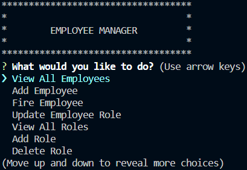

# Employee Tracker

## Description

Using SQL, create and manage a database of a business. Add, update, and delete employees, their roles, and their departments.

## Screenshot

[Video] (https://drive.google.com/file/d/1AGhxPorKsvQrF6iMJYu7bew22EomWxA1/view?usp=sharing)

## Table of Contents

- [Installation](#installation)
- [Usage](#usage)
- [Links](#links)
- [Credits](#credits)
- [License](#license)

## Installation

Installation is not required

## Usage

Open the project in your terminal Type `node index.js` to enter the application. Use the arrow keys to navigate the main menu and enter to choose a selection. For each option, follow the prompts to manage your employee database. Use the quit button to end the application.

## Links

- Deployment: This project is not deployed
- Repository: https://github.com/HeartSleeves/ILW12EmployeeTracker

## Credits

- Creator: Ivy Lovegood
- Github: https://github.com/Love-Ivy

## License

## Features

Inquirer, MySQL

## Questions?

Email me at: ivyroselovegood@gmail.com
